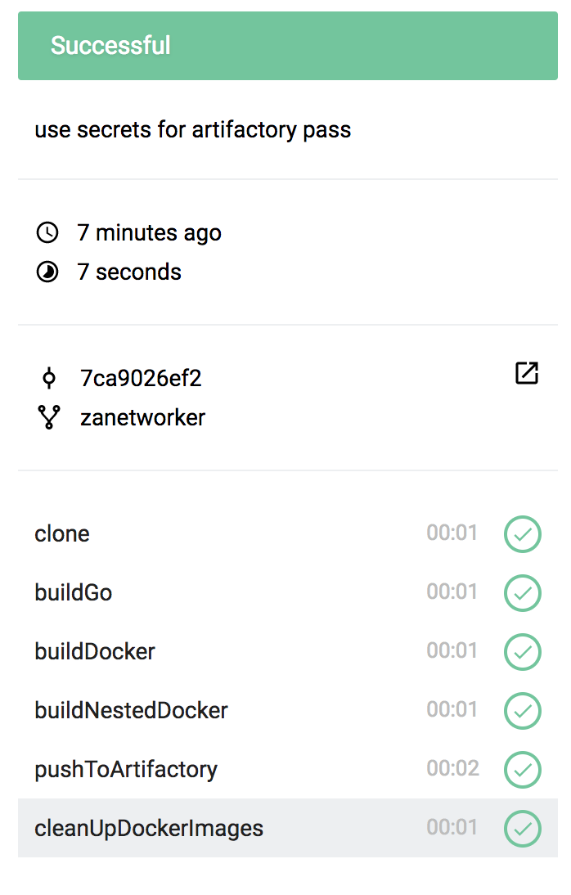

http://18.197.25.150//api/badges/zanetworker/cicd-hackathon-stgt/droneio/status.svg?branch=zanetworker

# Build and Push Docker images to artifactory

This usecase describes how to build parent docker images with Drone, use the parent images in Child images and push theese images to artifactory.

# Pipeline steps


## Our Application

```go
package main

import "fmt"

func main() {
	fmt.Println("hello droneio")
}
```

## Our Dockerfiles 

Parent Application 

```
FROM golang:latest 
RUN mkdir /app 
ADD droneio /app/ 
```

Child Application

```
FROM zanetworker/hello-drone
ENTRYPOINT  ["/app/droneio"]
```


## Our Pipeline Steps 



Our Pipeline 

```yaml
workspace:
  base: /go
  path: src/github.com/cicd-hackathon-stgt/droneio


pipeline: 
  buildGo: 
    image: golang 
    commands:
      - go build . 

  buildDocker:
    image: docker
    commands: 
      - docker build --rm -t ${parent_image} .
      - docker run --rm ${parent_image}
    volumes: 
      - /var/run/docker.sock:/var/run/docker.sock

  buildNestedDocker:
    image: docker
    commands:
      - docker build -f Dockerfile.depends --rm -t ${child_image} .
      - docker run --rm ${child_image}
    volumes: 
      - /var/run/docker.sock:/var/run/docker.sock 


  pushToArtifactory: 
    image: docker 
    commands:  
	# Use secrets for Artifactory password
    - docker login hohcicd-docker.jfrog.io -u ${artifactory_user} -p $ARTIFACTORY_PASS
    - docker tag ${parent_image} ${artifactory_repo_tag}/${parent_image}:latest
    - docker tag ${child_image} ${artifactory_repo_tag}/${child_image}:latest
    - docker push ${artifactory_repo_tag}/${parent_image}:latest
    - docker push ${artifactory_repo_tag}/${child_image}:latest
    secrets: [ artifactory_pass ]
    volumes: 
    - /var/run/docker.sock:/var/run/docker.sock 
  cleanUpDockerImages: 
     image: docker 
     commands: 
       - docker rmi ${parent_image} 
       - docker rmi ${child_image}
     volumes: 
      - /var/run/docker.sock:/var/run/docker.sock 

matrix:
  parent_image:
   - zanetworker/hello-drone
  child_image: 
   - zanetworker/child-drone
  artifactory_repo_tag: 
   - hohcicd-docker.jfrog.io
  artifactory_user: 
   - droneio
``` 
